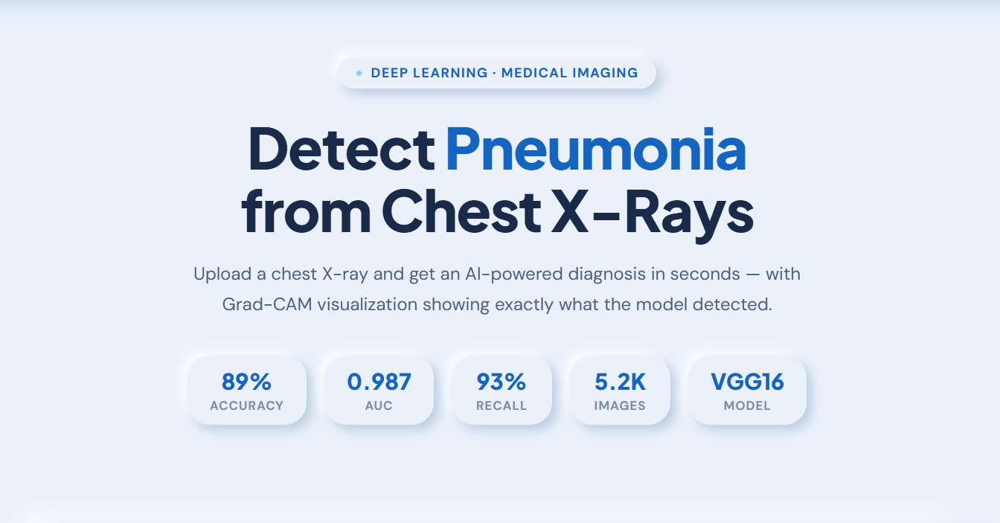

# 🫁 PneumoScan AI — Chest X-Ray Pneumonia Classifier

> AI-powered diagnostic tool that detects pneumonia from chest X-rays using VGG16 transfer learning, with real-time Grad-CAM visualization showing exactly what the model detected.

[](https://huggingface.co/spaces/osamaki/pneumoscan-ui)
[](https://huggingface.co/spaces/osamaki/pneumoscan)
[](https://github.com/eng-osama-almana/chest-xray-pneumonia-classifier)
[](https://github.com/eng-osama-almana/chest-xray-pneumonia-classifier)
[](LICENSE)

---

## 🌐 Live Demo

👉 **[Try it here → huggingface.co/spaces/osamaki/pneumoscan-ui](https://huggingface.co/spaces/osamaki/pneumoscan-ui)**

Upload any chest X-ray and get an instant AI-powered diagnosis with Grad-CAM visualization — no setup required!!

---

## 📸 Screenshots

### 🎨 Demo Interface


### 🧠 Grad-CAM Visualization

> Red regions show where the model detected pneumonia patterns — exactly where a radiologist would look!!

### 📊 Confusion Matrix


---

## 📊 Model Performance

| Metric | Score |
|--------|-------|
| **Test Accuracy** | 89% |
| **AUC** | 0.988 |
| **Pneumonia Recall** | 93% |
| **Pneumonia Precision** | 89% |
| **F1-Score** | 0.91 |

> Trained on 5,216 chest X-ray images (Kaggle dataset by Paul Mooney)

---

## 🏗️ Architecture

```
Input X-Ray (224×224×3)
        ↓
VGG16 (pretrained on ImageNet — frozen)
14.7M parameters — already knows textures & patterns
        ↓
GlobalAveragePooling2D
        ↓
Dense(256, ReLU) + Dropout(0.5)
        ↓
Dense(128, ReLU) + Dropout(0.3)
        ↓
Dense(1, Sigmoid)
        ↓
Output: NORMAL 🟢 or PNEUMONIA 🔴
```

**Why Transfer Learning?**
VGG16 was pretrained on 14 million ImageNet images and already knows how to detect edges, textures, and complex visual patterns. We freeze its weights and only train our custom classification head — giving us research-level performance with only 5,216 training images!!

---

## 🔬 Grad-CAM Visualization

Gradient-weighted Class Activation Mapping (Grad-CAM) highlights which regions of the X-ray most influenced the model's decision:

- 🔴 **Red/Yellow** → High importance — model focused heavily here
- 🔵 **Blue** → Low importance — model largely ignored this area

For pneumonia cases, the red regions consistently appear over the lung fields where consolidation/opacification is present — proving the model learned clinically meaningful features, not shortcuts!!

---

## 📁 Project Structure

```
chest-xray-pneumonia-classifier/
├── 📓 chest_xray_classifier.ipynb  ← Full training notebook
├── 🌐 xray_classifier.html         ← Beautiful demo frontend
├── 🐍 app.py                       ← Hugging Face Gradio backend
├── 📋 requirements.txt             ← Python dependencies
├── 📸 screenshots/
│   ├── UI.png                      ← Demo interface
│   ├── Grad-CAM result.png         ← Sample Grad-CAM output
│   └── confusion matrix.png        ← Model evaluation
└── 📄 README.md
```

---

## 🚀 How to Run Locally

### Prerequisites
```bash
pip install tensorflow keras numpy opencv-python matplotlib scikit-learn gradio
```

### 1. Clone the repo
```bash
git clone https://github.com/eng-osama-almana/chest-xray-pneumonia-classifier.git
cd chest-xray-pneumonia-classifier
```

### 2. Download the dataset
Get the Chest X-Ray dataset from Kaggle:
```
https://www.kaggle.com/datasets/paultimothymooney/chest-xray-pneumonia
```

### 3. Train the model
Open `chest_xray_classifier.ipynb` in Google Colab or Jupyter and run all cells!!

> **Tip:** Use Google Colab with T4 GPU for ~90 seconds per epoch!!

### 4. Run the demo
```bash
python app.py
```

---

## 📦 Dataset

- **Source:** [Chest X-Ray Images (Pneumonia) — Kaggle](https://www.kaggle.com/datasets/paultimothymooney/chest-xray-pneumonia)
- **Author:** Paul Mooney
- **Size:** 5,216 images (Train: 4,695 | Val: 521 | Test: 624)
- **Classes:** NORMAL (1,341) | PNEUMONIA (3,875)

> Note: Dataset is imbalanced (3:1 pneumonia:normal ratio). We handled this using class weights during training!!

---

## 🛠️ Tech Stack

| Component | Technology |
|-----------|-----------|
| **Deep Learning** | TensorFlow / Keras |
| **Base Model** | VGG16 (ImageNet pretrained) |
| **Visualization** | Grad-CAM + OpenCV |
| **Frontend** | HTML, CSS, JavaScript |
| **Backend** | Gradio |
| **Deployment** | Hugging Face Spaces |
| **Training** | Google Colab (T4 GPU) |

---

## 🏥 Clinical Context

Pneumonia is a leading cause of death worldwide. Chest X-ray is the most common diagnostic imaging tool used to detect it. This tool demonstrates how AI can:

- **Automate** routine X-ray screening
- **Reduce** inter-observer variability between radiologists
- **Explain** its decisions via Grad-CAM (making it trustworthy)
- **Assist** in resource-limited clinical settings

> ⚠️ **Disclaimer:** This tool is for educational purposes only and is not a substitute for professional medical diagnosis. Always consult a qualified radiologist.

---

## 📈 Training Details

| Parameter | Value |
|-----------|-------|
| **Optimizer** | Adam (lr=1e-4) |
| **Loss** | Binary Crossentropy |
| **Epochs** | 20 (Early stopping) |
| **Batch Size** | 32 |
| **Image Size** | 224×224 |
| **Augmentation** | Rotation, flip, zoom, shift |
| **Class Weights** | Yes (handles imbalance) |

---

## 👤 About

**Osamah Almana**
Biomedical Engineering Student · Imam Abdulrahman Bin Faisal University (IAU)

[](https://www.linkedin.com/in/osamah-almana-8215b733a)
[](https://github.com/eng-osama-almana)
[](https://huggingface.co/spaces/osamaki/pneumoscan-ui)

---

## ⭐ If you found this useful, please star the repo!!
